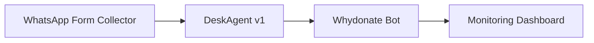

# Local AI Campaign Assistant
A high-efficiency, local system designed to automate the lifecycle of humanitarian campaign creation and management.

## 🧭 Philosophy: Sovereignty over Time
This project operates on the principle that we are the **natural owners of our time**. We reject the loss of resources, value, and human potential to repetitive manual labor. 

See [PRINCIPLES.md](file:///c:/Users/gaelf/Documents/GitHub/local_ai_campaign_assistant/PRINCIPLES.md) for our core axioms.

## 🏗️ Core Pipeline

## 🚀 Key Features
- **Deterministic Naming**: Stable [Name Policy](file:///c:/Users/gaelf/Documents/GitHub/local_ai_campaign_assistant/scripts/implement_name_policy.py) for beneficiary unique IDs.
- **Batch Migration**: Automated migration from legacy platforms to modern fundraising infrastructure.
- **Local Intelligence**: Utilizing local AI models to preserve privacy and minimize external dependency.
- **Algorithmic Independence**: Resilient to the "moralizing" biases and censorship of external AI platforms.
